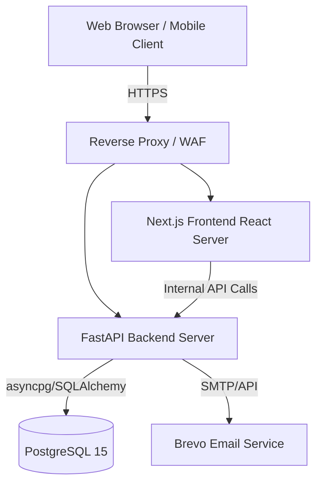

# System Architecture Document

**Date:** 2026-08-04
**Project:** AMPLIVO

## Overview
The AMPLIVO application is designed with a modern decoupled architecture, ensuring scalability, security, and developer productivity. It follows a classic 3-tier architecture paradigm, optimized for the cloud.

## High-Level Architecture

## Component Breakdown

### 1. Presentation Tier (Frontend)
- **Framework:** Next.js with React (App Router).
- **Styling:** Tailwind CSS combined with Framer Motion for micro-animations.
- **State Management:** React Context API with functional hooks.
- **Forms:** React Hook Form coupled with Zod for robust client-side validation.

### 2. Application Tier (Backend)
- **Framework:** FastAPI (Python 3.12+).
- **Architecture Pattern:** N-Tier Layered Architecture (Controllers -> Services -> Repositories -> Models).
- **Concurrency:** Fully asynchronous execution via `async/await` utilizing Uvicorn and Starlette.
- **Security Middlewares:** Built-in layers for Rate Limiting, CORS, CSRF, and Content Security Policy (CSP).

### 3. Data Tier (Database)
- **Engine:** PostgreSQL 15+.
- **ORM:** SQLAlchemy 2.0 with asynchronous drivers (`asyncpg`).
- **Migrations:** Alembic.
- **Design:** Strict referential integrity, UUIDv4 primary keys, and comprehensive auditing (Audit Logs).

## Deployment Topology
- The application is containerized using Docker.
- A central `docker-compose.yml` orchestrates the services for local and staging environments.
- CI/CD pipelines (GitHub Actions) automate testing, security audits, and deployment preparation.
