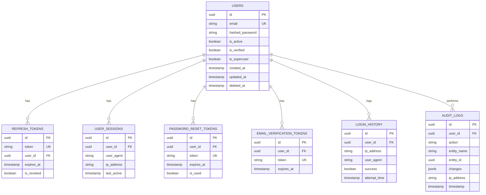

# Entity Relationship (ER) Diagram

**Date:** 2026-08-04
**Project:** AMPLIVO

## Database Architecture
The AMPLIVO backend leverages a relational data model (PostgreSQL) mapped via SQLAlchemy ORM. The following diagram illustrates the relationships between the core authentication and auditing entities.

